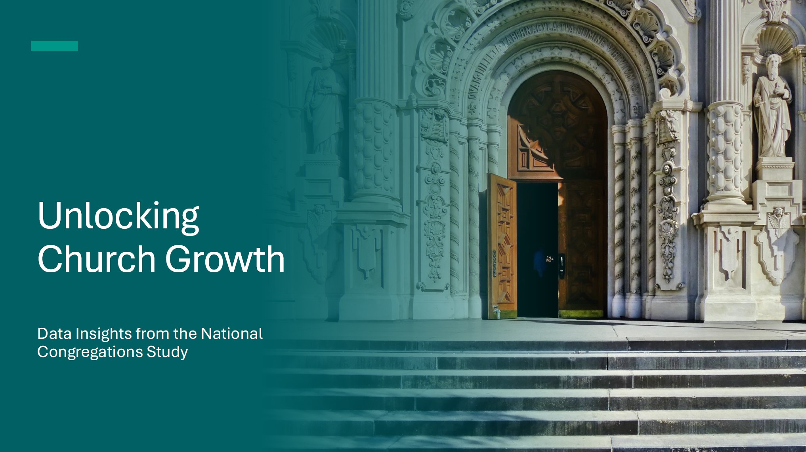
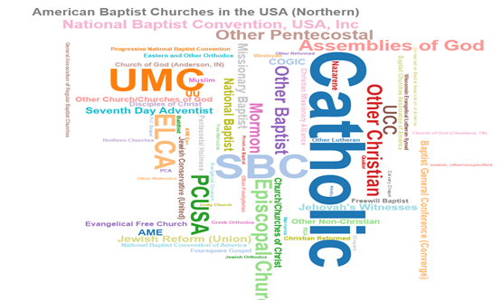
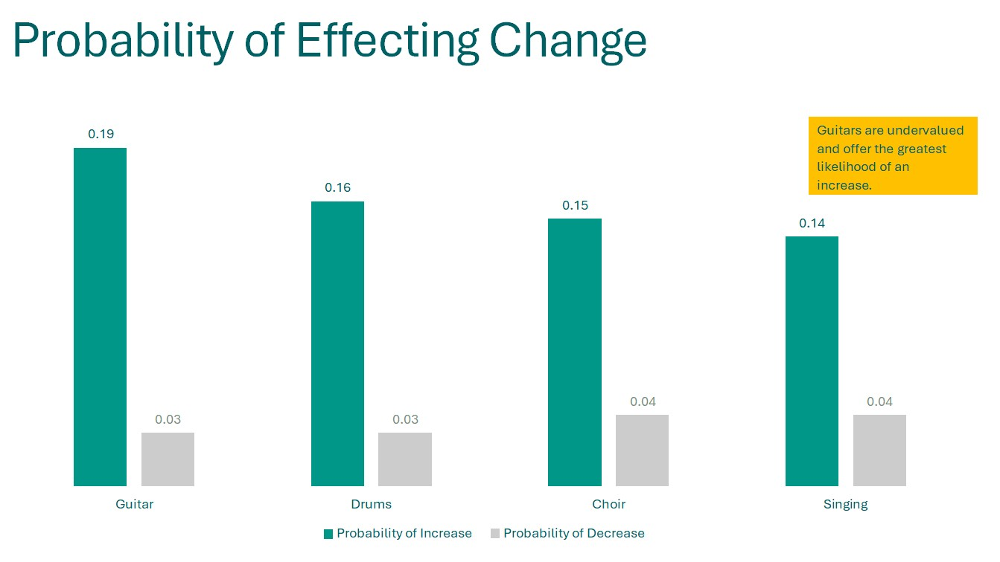

<!-- PROJECT LOGO -->
<br />
<div align="center">
  <a href="https://github.com/NRSchaaf/unlocking-church-growth.git">
    
  </a>

<!-- <h1 align="center">Unlocking Church Growth: Data Insights from the National Congregations Study</h3> -->

  <p align="center">
    This analysis helps to identify targeted strategies to improve congregational engagement and increase church attendance.
    <br />
    <br />
    <a href="https://1drv.ms/b/s!Am1b1E8pcdH6ip1j-j-bp02xxaC5Tw?e=hfeL6o">Analysis Report</a>
    ·
    <a href="https://youtu.be/Y86CWnlXKE0?si=LRvVBhbm_IbL3tDo">Analysis Presentation</a>
    <br />
    <br />
    <strong>July 10, 2024</strong>
  </p>
</div>


<!-- TABLE OF CONTENTS -->
<details>
  <summary>Table of Contents</summary>
  <ol>
    <li>
      <a href="#about-the-project">About The Project</a>
      <ul>
        <li><a href="#tools">Tools</a></li>
      </ul>
    </li>
    <li>
      <a href="#getting-started">Getting Started</a>
      <ul>
        <li><a href="#prerequisites">Prerequisites</a></li>
        <li><a href="#installation">Installation</a></li>
      </ul>
    </li>
    <li><a href="#usage">Usage</a></li>
    <li><a href="#roadmap">Roadmap</a></li>
    <li><a href="#license">License</a></li>
    <li><a href="#contact">Contact</a></li>
    <li><a href="#references">References</a></li>
  </ol>
</details>


<!-- ABOUT THE PROJECT -->
## About The Project

<p align="center">
  
</p>

“Over the past two decades American churches have seen a decline in regular attendance and participation” (Jones, 2024). And since the 2019 Covid pandemic, many churches have not recovered to their pre-covid attendance levels. By using probabilistic prediction models, we can explore existing church features to gauge their impact on changing congregational size. This analysis helps to identify targeted strategies to improve congregational engagement and increase church attendance.
<br />
<br />
The National Congregations Study, Cumulative Dataset (1998, 2006-2007, 2012, and 2018-2019) provides a comprehensive view of congregations across the U.S. and includes a wide range of religious denominations. It includes data from 5,333 congregations and 1,083 features/questions, collected over four periods, and representative of 70 unique denominations.

<p align="right">(<a href="#readme-top">back to top</a>)</p>


### Tools

* Jupyter Notebook
* Python

<p align="right">(<a href="#readme-top">back to top</a>)</p>


<!-- GETTING STARTED -->
## Getting Started

To get a local copy up and running follow these simple example steps.

### Prerequisites

You'll need to install Jupyter Notebook and Python to view the analysis in the notebooks (.ipyb files).
* Jupyter Notebook
  ```sh
  pip install notebook
  ```
* Python
  ```sh
  https://www.python.org/downloads/
  ```

### Installation

1. Clone the repo
   ```sh
   git clone https://github.com/NRSchaaf/unlocking-church-growth.git
   ```
2. Install Python packages
   ```sh
   pip install pandas
   ```
   ```sh
   pip install numpy
   ```
   ```sh
   python -m pip install -U pip
   python -m pip install -U matplotlib
   ```
   ```sh
   pip install seaborn
   ```
   ```sh
   pip install requests
   ```
   ```sh
   python -m pip install scipy
   ```
   ```sh
   pip install -U scikit-learn
   ```
   ```sh
   pip install -U imbalanced-learn
   ``` 

<p align="right">(<a href="#readme-top">back to top</a>)</p>


<!-- USAGE EXAMPLES -->
## Usage

<p align="center">
  
</p>

This analysis is intended for decision-makers within religious congregations, including clergy, religious leaders, elders or board members, program leaders, employees, and committee leaders. These individuals are responsible for worship, programming, and other activities that engage the general congregation or are sponsored by the organization.
<br />
<br />
Consider how your congregation compares to the analysis. You can use the probability graphs to guage which features you can include or discontinue to increase your probability of growing your congregation's membership.

_For details, please refer to the [Analysis Report](https://1drv.ms/b/s!Am1b1E8pcdH6ip1j-j-bp02xxaC5Tw?e=hfeL6o)_

<p align="right">(<a href="#readme-top">back to top</a>)</p>


<!-- ROADMAP -->
## Roadmap

- [ ] Analysis.ipynb contains the general denomination information about the dataset.
- [ ] facilities_analysis.ipynb contains the analysis of features related to congregational facilities.
- [ ] music_analysis.ipynb contains the analysis of musical features in worship services.
- [ ] worship_analysis.ipynb contains the analysis of features in worship services.
- [ ] program_analysis.ipynb contains the analysis of inclusion of specific programs offered by the congregation.
- [ ] staffing_analysis.ipynb contains the analysis of various jobs/positions.
- [ ] dictionaries.py is a file to translate the ordinal values of the dataset into categorical values.
- [ ] For a detailed list of specific features analyzed within each category, please refer to [FEATURES.md](FEATURES.md).

<p align="right">(<a href="#readme-top">back to top</a>)</p>


<!-- LICENSE -->
## License

Distributed under the MIT License. See `LICENSE.txt` for more information.

<p align="right">(<a href="#readme-top">back to top</a>)</p>


<!-- CONTACT -->
## Contact

Nathan Schaaf - [LinkedIn](https://www.linkedin.com/in/nathan-schaaf/) - nathan.rocky.schaaf@gmail.com

Project Link: [https://github.com/NRSchaaf/unlocking-church-growth.git](https://github.com/NRSchaaf/unlocking-church-growth.git)

<p align="right">(<a href="#readme-top">back to top</a>)</p>


<!-- REFERENCES -->
## References

* Chaves, M. (2021, January 25). National Congregations Study, Cumulative Dataset (1998, 2006-2007, 2012, and 2018-2019). The Association of Religion Data Archives. doi:10.17605/OSF.IO/V5ZKB. https://www.thearda.com/data-archive?fid=NCSIV.
* Jones, J. M. (2024, March 25). Church Attendance Has Declined in Most U.S. Religious Groups. Retrieved June 28, 2024, from GALLUP: https://news.gallup.com/poll/642548/church-attendance-declined-religious-groups.aspx

<p align="right">(<a href="#readme-top">back to top</a>)</p>
